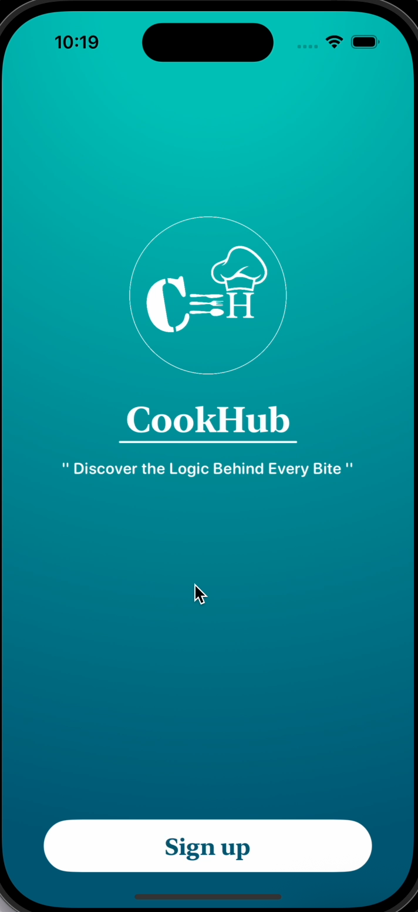
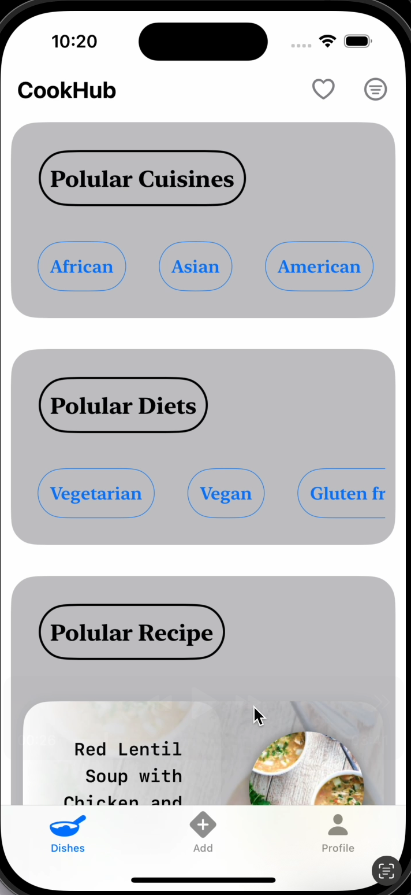
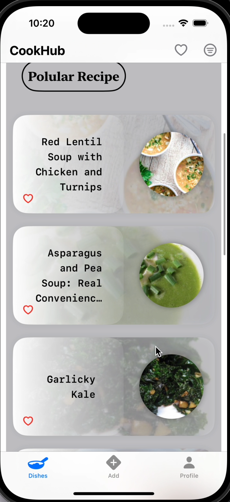
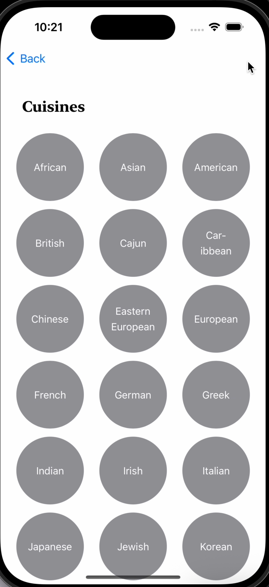
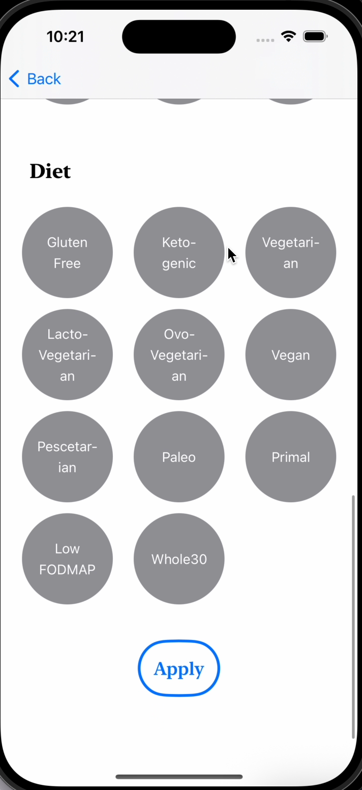
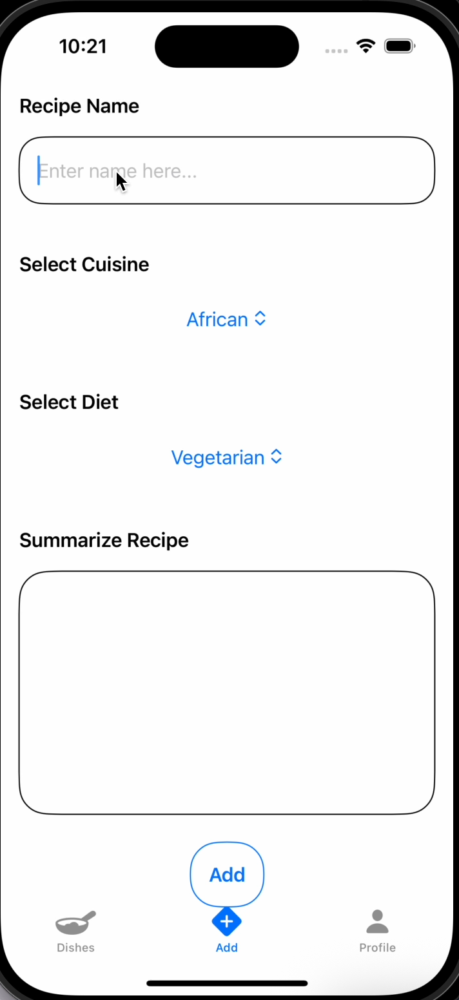

# 🍳 CookHub

CookHub is a cross-platform mobile application that helps users discover famous and authentic recipes from around the world. Recipes are organized by cuisine type, country of origin, dietary preferences, and food category — making it easy for anyone to explore global culinary traditions.

---

## ✨ Features

- 🌍 Browse recipes by **Cuisine**, **Country**, **Diet Type**, and **Food Category**
- 🔍 Powerful filters to customize recipe discovery
- 💾 Save your favorite recipes for quick access
- 🖼️ Visual recipe previews and detailed instructions
- 📲 Beautiful, responsive UI optimized for mobile
- ➕ **Add Your Own Recipes** — Easily contribute new recipes to the app!

---

## 🛠️ Tech Stack

| Layer            | Technology               |
|------------------|---------------------------|
| **Frontend**     | SwiftUI |
| **Backend**      | Firebase / REST API  |
| **Database**     | Firestore |
| **Authentication** | Firebase Auth  |
| **Storage**      | Firebase Storage / Local storage |

---

## 📷 Screenshots









---

## 🚀 Getting Started

### Prerequisites

- Xcode installed
- Git installed
- Firebase project set up

### Clone the Repo

```bash
git clone https://github.com/tusharg2210/CookHub.git
cd CookHub
```

### 🤝 Contributing
Contributions, issues, and feature requests are welcome!
Feel free to open a pull request.
